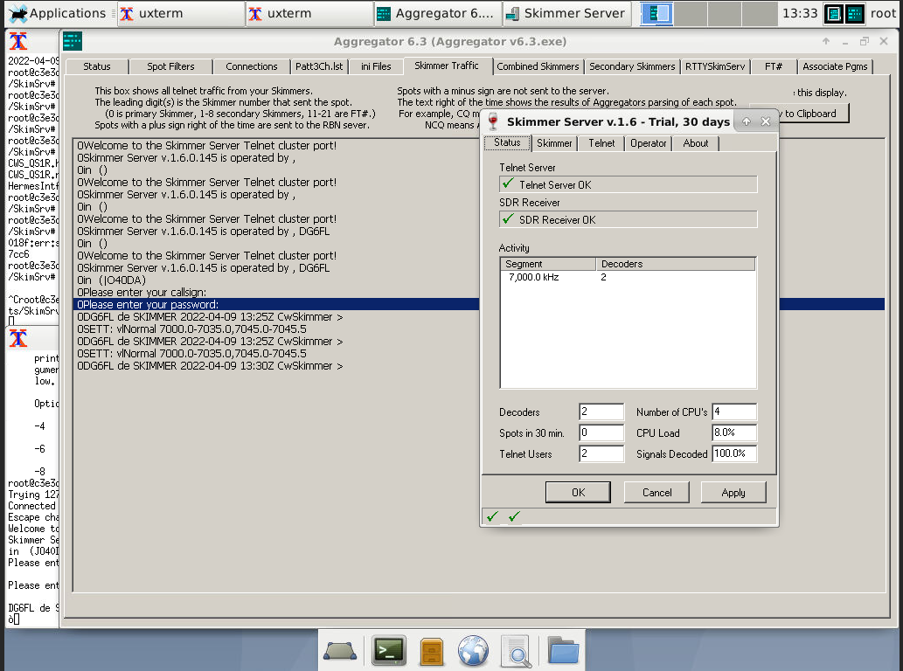
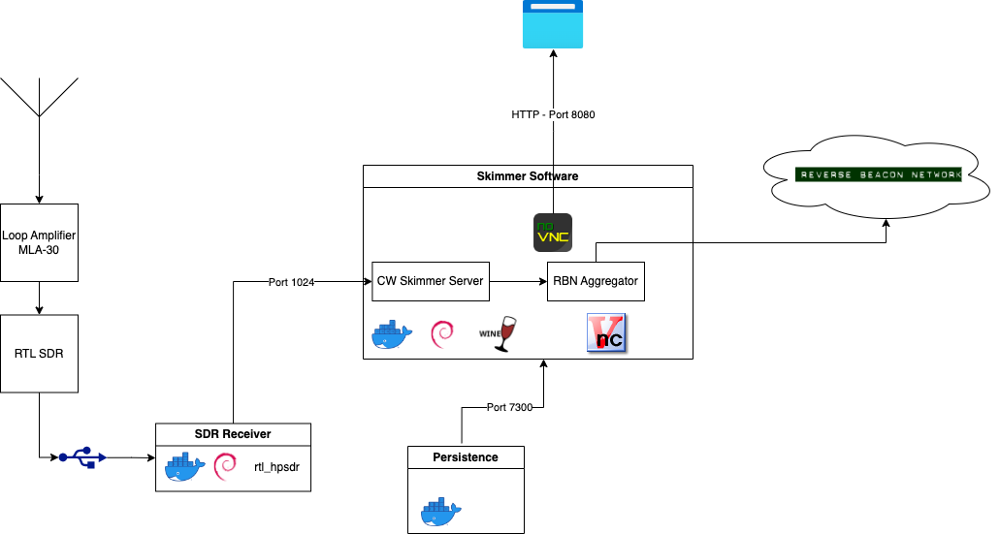
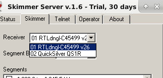

Run the famous CW Skimmer under docker, using wine and novnc for remote access.

# Quick start
+ `make build`
+ `make run`
+ `open http://127.0.0.1:7373`
+ Buy a license from: http://www.dxatlas.com/cwskimmer/ and enter the license key in CW Skimmer.

## Connecting to RTL SDR

+ RTL SDR with hermes simulation can run in docker, too using: https://github.com/8cH9azbsFifZ/librtlsdr

## Using docker-compose
+ Create a personal access token for ghcr.io, in order to pull the images

# References
+ https://sm7iun.se/redpitaya/cwskimmer/
+ https://github.com/k3it/HermesIntf/releases/tag/v21.7.18
+ http://www.reversebeacon.net/pages/Aggregator+34
